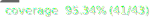

# Parrot Refactoring Kata


[](https://sonarcloud.io/summary/new_code?id=MacMannes_parrot-refactoring-kata)

## Description

Can you spot any code smells in this code? I'll give you a clue - a spot of Pol(l)ymorphism should improve matters!

Refactor this code, take small steps, run the tests often. See how small and beautiful and polymorphic you can make it.

Emily Bache made a [video explaining this kata](https://youtu.be/UxNEHKg_2eA), and videos with worked solutions:

- [in C#](https://youtu.be/IvFX8Ivit1k)
- [in Java](https://youtu.be/7IT6c8wwHs4)
- [in Python](https://youtu.be/pO_5DQ3vDtc)

There is also a Guided Learning Hour using this exercise:
[Everyday Design Improvements in OO Code](https://youtu.be/NCEWAqEFPic)

## Acknowlegements

This code comes from the [Github repo of Emily Bache](https://github.com/emilybache/Parrot-Refactoring-Kata) and is
heavily inspired by one of the examples in Martin Fowler's book "Refactoring". It's a classic, and if it's not on your
bookshelf already I suggest you treat yourself to a copy!

## Unit tests

Run the unit test with this command:

```shell
pnpm run test
```

## Coverage of unit tests

You can check the code coverage and view the html results by running this command:

```shell
pnpm run test:coverage && open coverage/index.html
```
