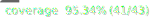

# Parrot Refactoring Kata


[](https://sonarcloud.io/summary/new_code?id=MacMannes_parrot-refactoring-kata)
    
## Description


## Unit tests

Run the unit test with this command:

```shell
pnpm run test
```

## Coverage of unit tests

You can check the code coverage and view the html results by running this command:

```shell
pnpm run test:coverage && open coverage/index.html
```
